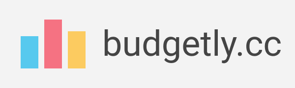

  

[Live Demo]()

## Intro

Currently in development. Free and Open Source budgeting app. Good quality product with an easy to use user interface.

## Description

The app is build with MERN stack and using RESTful API design. The client side is written in Typescript. Redux for state management, Node & Express for API, MongoDB as database.

The app is built with a robust and easily scalable structure.

## Technologies & Tools

### Front-end:

- Typescript
- React
- Redux
- Axios
- React Router
- Sass

### Backend:

- Node/Express
- MongoDB/Mongoose
